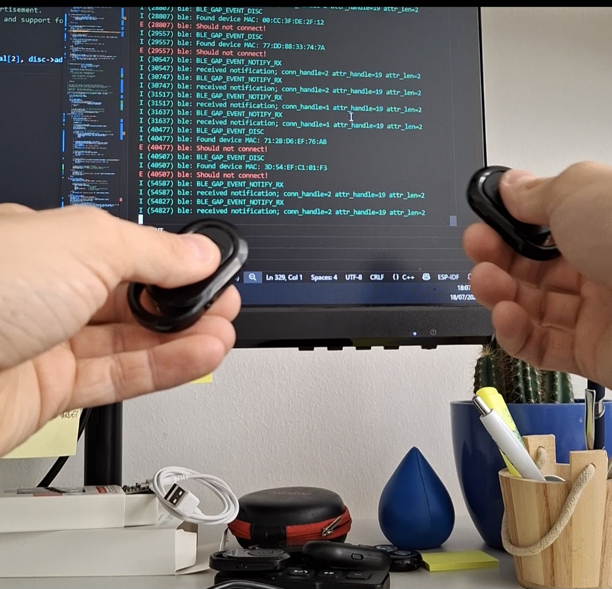

# BLE Button Project

This project implements a BLE (Bluetooth Low Energy) central device based on the ESP32-S3 microcontroller using the ESP-IDF framework. The device acts as a GATT client that performs passive scanning for BLE peripherals advertising support for the Current Time Service (CTS, UUID: 0x1805).



## Features

- **BLE Central Role**: Scans for and connects to BLE peripherals that support the Current Time Service.
- **Time Reading**: Reads the current time characteristic from connected devices.
- **LED Control**: Controls an onboard LED (GPIO 48) based on BLE events or time data.
- **Serial Communication**: Provides serial interface for monitoring and data exchange.
- **ESP-IDF Integration**: Built using Espressif's IoT Development Framework with NimBLE stack.

## Hardware Requirements

- ESP32-S3 development board (e.g., ESP32-S3-DevKitC)
- USB cable for power supply and programming
- BLE peripheral device that advertises Current Time Service (for testing)

## Software Requirements

- ESP-IDF v5.0 or later
- CMake
- Python 3.7 or later

## Build and Flash

1. Set the target chip:
   ```bash
   idf.py set-target esp32s3
   ```

2. Configure the project (optional, for custom settings):
   ```bash
   idf.py menuconfig
   ```

3. Build the project:
   ```bash
   idf.py build
   ```

4. Flash and monitor:
   ```bash
   idf.py -p <PORT> flash monitor
   ```

Replace `<PORT>` with your ESP32-S3's serial port (e.g., COM3 on Windows or /dev/ttyUSB0 on Linux).

## Usage

1. Power on the ESP32-S3 board.
2. The device will start BLE scanning for peripherals with Current Time Service.
3. When a compatible peripheral is found, it will attempt to connect.
4. Upon successful connection, it reads the current time and displays it via serial output.
5. The LED will indicate connection status and other events.

## Serial Output

The device outputs debug information and time data through the serial interface. Connect using a terminal program at 115200 baud rate.

```
I (358) BLE_INIT: BT controller compile version [59725b5]
I (358) BLE_INIT: Bluetooth MAC: 60:55:f9:68:c4:fa
...
I (3998) NimBLE_CTS_CENT: Date : 30/8/2023
I (3998) NimBLE_CTS_CENT: hours : 20 minutes : 37
I (3998) NimBLE_CTS_CENT: seconds : 2
```

## Configuration

The project uses default BLE settings. You can modify `sdkconfig` or use `idf.py menuconfig` to adjust:
- BLE device name
- Scan parameters
- Connection settings

## Project Structure

- `main/`: Source code directory
  - `main.cpp`: Main application entry point
  - `ble-cts-central.cpp`: BLE central implementation
  - `serial-module.cpp`: Serial communication module
  - `util.h`: Utility functions and definitions
- `CMakeLists.txt`: Project build configuration
- `sdkconfig`: Project configuration file

## Dependencies

- ESP-IDF components: NimBLE, FreeRTOS, GPIO drivers, UART
- Custom modules: BLE CTS central, serial communication

## Troubleshooting

- Ensure the ESP32-S3 target is set correctly: `idf.py set-target esp32s3`
- Check serial port permissions on Linux/macOS
- Verify BLE peripheral supports Current Time Service
- For build issues, clean and rebuild: `idf.py clean && idf.py build`

For technical queries, please refer to the [ESP-IDF documentation](https://docs.espressif.com/projects/esp-idf/) or open an issue on the project repository.
